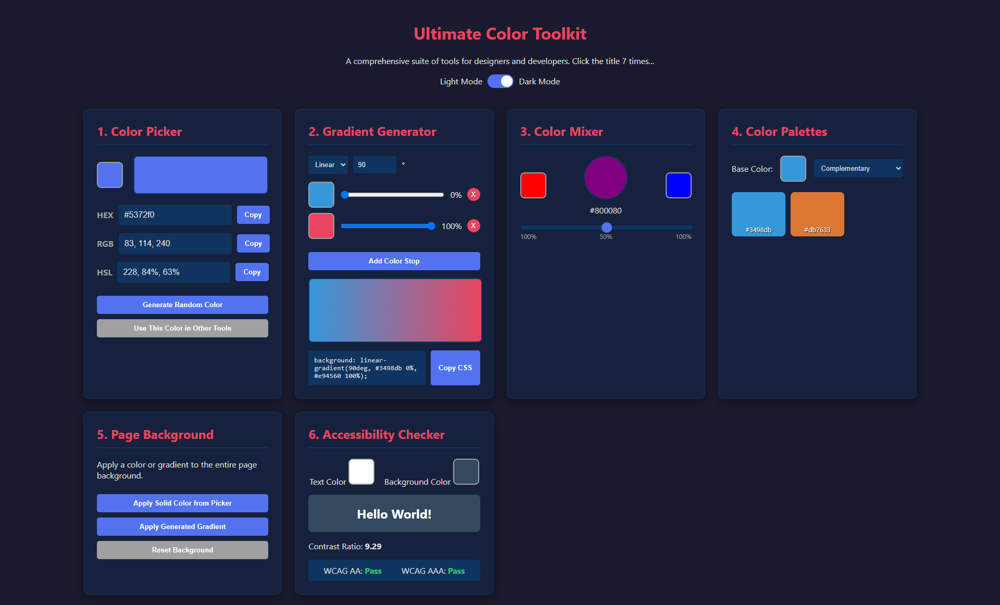

# Ultimate Color Toolkit

<div align="center">

[](https://opensource.org/licenses/MIT)
[](https://github.com/aakhalidhruv28/Color-Toolkit-Project/stargazers)
[](https://aakhalidhruv28.github.io/Color-Toolkit-Project/)

</div>

> An all-in-one web-based utility for color picking, mixing, gradient generation, palette creation, and accessibility checking. Built with pure HTML, CSS, and JavaScript.

<br>

<div align="center">
  
</div>

## ✨ Overview

The **Ultimate Color Toolkit** is a front-end application designed for developers, designers, and color enthusiasts. It provides a comprehensive suite of powerful, intuitive tools to handle all your color-related tasks in one place. From generating a simple color code to ensuring your designs are accessible, this toolkit has you covered. The entire project is built with vanilla HTML, CSS, and JavaScript, demonstrating modern web development techniques without relying on external frameworks.

<br>

<details>
  <summary><strong>📚 Table of Contents</strong></summary>
  <ol>
    <li><a href="#-key-features">Key Features</a></li>
    <li><a href="#-technologies-used">Technologies Used</a></li>
    <li><a href="#-live-demo">Live Demo</a></li>
    <li><a href="#-getting-started">Getting Started</a></li>
    <li><a href="#-how-to-use-the-tools">How to Use the Tools</a></li>
    <li><a href="#-license">License</a></li>
    <li><a href="#-contributing">Contributing</a></li>
  </ol>
</details>

## 🚀 Key Features

The toolkit is organized into six main tools and several creative "Easter Egg" features.

### 🎨 1. Color Picker
A robust tool for selecting and converting colors.
- **Native Color Picker:** A standard `<input type="color">` for visual selection.
- **Code Conversions:** Instantly see the selected color in **HEX**, **RGB**, and **HSL** formats.
- **Copy to Clipboard:** Easily copy any color code format with a single click.
- **Random Color:** Generate a random color to spark inspiration.
- **Cross-Tool Integration:** A dedicated button sends the selected color to the other tools for immediate use.

### 🌈 2. Gradient Generator
Create beautiful, custom CSS gradients with a live preview.
- **Gradient Types:** Choose between **Linear** and **Radial** gradients.
- **Angle Control:** Set the precise angle for linear gradients.
- **Dynamic Color Stops:** Add, remove, and change multiple color stops. Adjust their position on the gradient with a slider.
- **Live Preview:** See your gradient update in real-time as you make changes.
- **CSS Output:** Get the complete, ready-to-use CSS code for your gradient.

### 🧪 3. Color Mixer
Blend two colors together to find the perfect shade in between.
- **Dual Color Inputs:** Select two colors to mix.
- **Mixing Ratio Slider:** Control the percentage of each color in the final mix for precise blending.
- **Live Result:** The mixed color is displayed instantly with its HEX code.

### 🎨 4. Color Palette Generator
Generate harmonious color schemes based on color theory.
- **Base Color Selection:** Pick a starting color.
- **Harmony Rules:** Automatically generate palettes based on standard rules:
  - **Complementary**
  - **Analogous**
  - **Triadic**
  - **Split-Complementary**
  - **Monochromatic**
- **Interactive Swatches:** The generated palette is displayed as interactive swatches. Clicking a swatch sends its color to the main Color Picker.

### 🖥️ 5. Page Background Customizer
Instantly test colors and gradients on the page background.
- **Apply Solid Color:** Use the color from the picker to change the page background.
- **Apply Gradient:** Apply the gradient you created in the generator.
- **Reset:** Easily revert the background to the default theme color.

### ♿ 6. Accessibility Contrast Checker
Ensure your color choices are readable and accessible according to WCAG standards.
- **Foreground & Background Inputs:** Select a text color and a background color.
- **Live Preview:** See how the text looks on the background.
- **Contrast Ratio:** Calculates and displays the contrast ratio in real-time.
- **WCAG Ratings:** Instantly tells you if your color combination passes **AA** and **AAA** standards for normal text.

### 🥚 Creative Features & Easter Eggs
- **Dynamic Light/Dark Mode:** A sleek toggle to switch between a light and dark theme, with preferences saved to local storage.
- **Secret Info Section:** Click the main page title 7 times to reveal a hidden section with fun facts about color theory.
- **Konami Code Disco Mode:** Enter the classic Konami Code (`↑ ↑ ↓ ↓ ← → ← → B A`) to trigger a wild, color-changing "disco mode" for the page background.

## 🛠️ Technologies Used

This project is built from the ground up using only core web technologies.
- **HTML5:** Semantic markup for structure and accessibility.
- **CSS3:** Advanced styling, including CSS Variables (Custom Properties) for theming, Flexbox, and Grid for layout.
- **JavaScript (ES6+):** All logic, interactivity, and DOM manipulation are handled with modern, vanilla JavaScript.

## 🌐 Live Demo

Experience the Ultimate Color Toolkit in action:

**[https://aakhalidhruv28.github.io/Color-Toolkit-Project/](https://aakhalidhruv28.github.io/Color-Toolkit-Project/)**

## 🚀 Getting Started

To run this project locally, follow these simple steps:

1.  **Clone the repository:**
    ```bash
    git clone https://github.com/aakhalidhruv28/Color-Toolkit-Project.git
    ```

2.  **Navigate to the project directory:**
    ```bash
    cd Color-Toolkit-Project
    ```

3.  **Open the `index.html` file in your browser:**
    - You can simply double-click the `index.html` file, or right-click and choose "Open with" your preferred browser.
    - No build steps or dependencies are required!

## 📜 License

This project is licensed under the MIT License. See the [LICENSE](LICENSE) file for more details.

---

MIT License

Copyright (c) 2023 Aakhalid Dhruv

Permission is hereby granted, free of charge, to any person obtaining a copy
of this software and associated documentation files (the "Software"), to deal
in the Software without restriction, including without limitation the rights
to use, copy, modify, merge, publish, distribute, sublicense, and/or sell
copies of the Software, and to permit persons to whom the Software is
furnished to do so, subject to the following conditions:

The above copyright notice and this permission notice shall be included in all
copies or substantial portions of the Software.

THE SOFTWARE IS PROVIDED "AS IS", WITHOUT WARRANTY OF ANY KIND, EXPRESS OR
IMPLIED, INCLUDING BUT NOT LIMITED TO THE WARRANTIES OF MERCHANTABILITY,
FITNESS FOR A PARTICULAR PURPOSE AND NONINFRINGEMENT. IN NO EVENT SHALL THE
AUTHORS OR COPYRIGHT HOLDERS BE LIABLE FOR ANY CLAIM, DAMAGES OR OTHER
LIABILITY, WHETHER IN AN ACTION OF CONTRACT, TORT OR OTHERWISE, ARISING FROM,
OUT OF OR IN CONNECTION WITH THE SOFTWARE OR THE USE OR OTHER DEALINGS IN THE
SOFTWARE.

## 🤝 Contributing

Contributions, issues, and feature requests are welcome! Feel free to check the [issues page](https://github.com/aakhalidhruv28/Color-Toolkit-Project/issues).

````Made with ❤️ by Dhruv Aakhali.````
